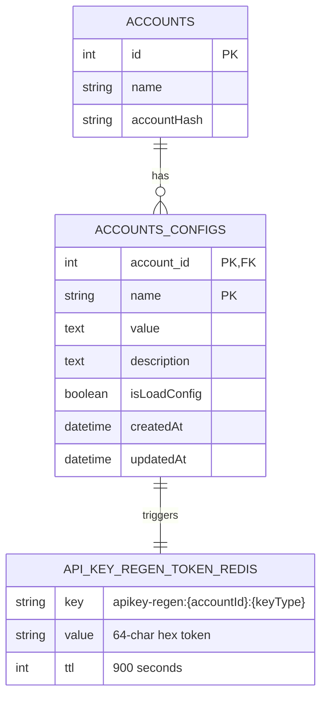

# 2FA-Protected API Key Generation

## Overview

Add a secure API key regeneration flow to the Settings page. Users can request a new API key (`api_key` or `api_key_tracker`), which triggers an email confirmation. The user clicks a link in the email, returns to the frontend with a token, and the system validates the token before generating a new key. The UI also shows when an API key is expired.

## Problem Statement / Motivation

Currently, API keys are generated once during account creation using deterministic MD5 hashes (`createHash('md5').update('bms-${id}-api_key')`). There is no way for users to rotate or regenerate keys. If a key is compromised, there is no self-service recovery. The Settings page has an empty "API Key" tab (navbar index 1) that renders nothing.

## Proposed Solution

### High-Level Flow

```
User clicks "Generate" → API creates token in Redis → Email sent via Pub/Sub
    → User clicks email link → Frontend receives token via query param
    → Frontend sends token to API → API validates, generates new key, purges cache
    → Frontend displays new key
```

### Architecture Decisions

1. **Token storage**: Redis with 15-minute TTL (matches existing verify module pattern)
2. **Token format**: `crypto.randomBytes(32).toString('hex')` — 64-char hex string, cryptographically secure
3. **New key format**: `crypto.randomBytes(32).toString('hex')` — replaces deterministic MD5
4. **Email delivery**: Pub/Sub to `TOPIC_NAME_SEND_EMAIL` (existing transactional email path)
5. **Rate limiting**: One pending request per key type per account (new request overwrites old token in Redis)
6. **API Key expiration**: New `api_key_expires_at` / `api_key_tracker_expires_at` config entries in `accounts_configs` table. Keys expire after 90 days. Existing accounts without these configs are treated as expired (prompting users to regenerate).
7. **Frontend routing**: Handle `?token=...&keyType=...` query params in `Settings.vue` `mounted()` hook. The `authGuard` preserves query params through Auth0 redirect, so this works even if the user's session expired.
8. **Confirm endpoint requires authentication**: The `confirm-regen` endpoint requires JWT auth (same as all other account endpoints). If the user clicks the email link on a different device, they must log in first — Auth0 redirect preserves the query params so the flow completes after login.

## Technical Approach

### System Components

```
┌──────────────────────────────────────────────────────────┐
│                     FRONTEND (Vue 2)                      │
│                                                          │
│  Settings.vue ─── ApiKeyConfig.vue (new, tab index 1)   │
│       │                  │                                │
│       │           "Generate" button                       │
│       │                  │                                │
│       ├── reads ?token query param on mount               │
│       │                  │                                │
│       └── api-key.service.ts (new)                       │
│              │                    │                        │
│     POST /request-regen    POST /confirm-regen            │
└──────────────────────────────────────────────────────────┘
                    │                    │
┌──────────────────────────────────────────────────────────┐
│                      API (NestJS)                         │
│                                                          │
│  AccountsController (extended) ── ApiKeyRegenService (new)│
│       │                         │                         │
│  POST /accounts/:id/           │                         │
│    api-keys/request-regen      ├── Redis (token store)   │
│                                ├── Pub/Sub (send email)  │
│  POST /accounts/:id/          ├── AccountConfigEntity    │
│    api-keys/confirm-regen     └── AccountCacheService    │
│                                                          │
│  GET /accounts/:id/                                      │
│    api-keys/status            (expiration check)         │
└──────────────────────────────────────────────────────────┘
```

### Implementation Phases

---

#### Phase 1: API — Token Generation & Email (msgops-api)

##### 1.1 Create `ApiKeyRegenService`

**File**: `src/modules/accounts/api-key-regen.service.ts`

```typescript
// Dependencies: RedisService, PubSubProvider, AccountsService, AccountCacheService
//
// Methods:
//   requestRegeneration(accountId, keyType, userId) → void
//     - Looks up user by userId to get email and name (from UsersService or JWT claims)
//     - Generates token: crypto.randomBytes(32).toString('hex')
//     - Stores in Redis: key = `apikey-regen:${accountId}:${keyType}`, value = token, TTL = 900 (15 min)
//     - Constructs email with confirmation link: ${FRONTEND_URL}/settings?token=${token}&keyType=${keyType}
//     - Publishes email to Pub/Sub topic TOPIC_NAME_SEND_EMAIL (to user's email)
//
//   confirmRegeneration(accountId, keyType, token) → { newKey: string, expiresAt?: string }
//     - Reads token from Redis: key = `apikey-regen:${accountId}:${keyType}`
//     - Compares with provided token (timing-safe comparison)
//     - If invalid/expired: throw HttpException 400/410
//     - Generates new key: crypto.randomBytes(32).toString('hex')
//     - Updates accounts_configs row (accountId, keyType) with new value
//     - Sets `${keyType}_expires_at` config to 90 days from now
//     - Calls AccountCacheService.invalidateAccountCache(accountId)
//     - Deletes token from Redis
//     - Returns { newKey, expiresAt }
//
//   getKeyStatus(accountId, keyType) → { isExpired: boolean, expiresAt?: string }
//     - Reads `${keyType}_expires_at` from accounts_configs
//     - Returns expiration status
```

##### 1.2 Add Endpoints to `AccountsController`

**File**: `src/modules/accounts/accounts.controller.ts`

```typescript
// POST /accounts/:id/api-keys/request-regen
// Auth: JWT required (sends email to the authenticated user)
// Body: { keyType: 'api_key' | 'api_key_tracker' }
// Headers: Authorization (JWT), User-Id, Account-Id
// Response: 200 { message: 'Confirmation email sent' }
// Errors: 429 (already pending within 2 min), 400 (invalid keyType)

// POST /accounts/:id/api-keys/confirm-regen
// Auth: JWT required (user must be logged in — email link redirects through Auth0 if needed)
// Body: { token: string, keyType: 'api_key' | 'api_key_tracker' }
// Response: 200 { newKey: string, expiresAt: string }
// Errors: 400 (invalid token), 410 (expired token)

// GET /accounts/:id/api-keys/status
// Response: 200 { api_key: { isExpired, expiresAt }, api_key_tracker: { isExpired, expiresAt } }
```

##### 1.3 Email Template

The email should be a simple transactional message published to Pub/Sub following the existing `parseMessageToSendEmail` pattern in `src/utils/utils.service.ts`.

**Email content** (HTML):
- Subject: "Confirmação de nova API Key" / "API Key Regeneration Confirmation"
- Body: Greeting with user name, explanation that a new API key was requested, prominent CTA button with the confirmation link, note that the link expires in 15 minutes, warning that if they didn't request this they can ignore the email
- The `FRONTEND_URL` env var must be available in the API (add to `.env` if not present)

##### 1.4 DTO Validation

**File**: `src/modules/accounts/dtos/api-key-regen.dto.ts`

```typescript
// RequestRegenDto: { keyType: Joi.string().valid('api_key', 'api_key_tracker').required() }
// ConfirmRegenDto: { token: Joi.string().hex().length(64).required(), keyType: Joi.string().valid('api_key', 'api_key_tracker').required() }
```

##### 1.5 Register in `AccountsModule`

**File**: `src/modules/accounts/accounts.module.ts`

- Add `ApiKeyRegenService` to providers

---

#### Phase 2: Frontend — API Key Tab & Request Flow (msgops-frontend)

##### 2.1 Create API Key Service

**File**: `src/modules/settings/services/api-key.service.ts`

```typescript
// Methods:
//   requestRegeneration(accountId, keyType) → Promise<void>
//     POST /accounts/${accountId}/api-keys/request-regen { keyType }
//
//   confirmRegeneration(accountId, token, keyType) → Promise<{ newKey, expiresAt }>
//     POST /accounts/${accountId}/api-keys/confirm-regen { token, keyType }
//
//   getKeyStatus(accountId) → Promise<{ api_key: StatusObj, api_key_tracker: StatusObj }>
//     GET /accounts/${accountId}/api-keys/status
```

##### 2.2 Create `ApiKeyConfig.vue` Component

**File**: `src/modules/settings/components/ApiKeyConfig.vue`

This component renders in `Settings.vue` when `navBarOptionIndex == 1`.

**UI layout:**
```
┌─────────────────────────────────────────────────┐
│  API Keys                                        │
│                                                  │
│  API Key                                         │
│  ┌──────────────────────────────┐  ┌──────────┐ │
│  │ a1b2c3d4e5...  (masked)     │  │ Gerar    │ │
│  └──────────────────────────────┘  └──────────┘ │
│  ⚠️ Expirada — gere uma nova chave              │
│                                                  │
│  API Key Tracker                                 │
│  ┌──────────────────────────────┐  ┌──────────┐ │
│  │ f6g7h8i9j0...  (masked)     │  │ Gerar    │ │
│  └──────────────────────────────┘  └──────────┘ │
│  Expira em: 15/06/2026                           │
│                                                  │
│  ┌──────────────────────────────────────────────┐│
│  │ ℹ️ Ao gerar uma nova API Key Tracker, todos  ││
│  │ os scripts de tracking implantados em seus   ││
│  │ sites deixarão de funcionar até que o novo   ││
│  │ código seja atualizado.                      ││
│  └──────────────────────────────────────────────┘│
└─────────────────────────────────────────────────┘
```

**Behavior:**
- Fetches key status on mount via `getKeyStatus()`
- Shows expiration badge (expired = red warning, valid = gray date)
- "Gerar" button opens a confirmation modal (`ModalService.confirm()`)
- For `api_key_tracker`, modal includes the warning about breaking tracker scripts
- On confirm, calls `requestRegeneration()`, shows success toast: "E-mail de confirmação enviado"
- Button shows loading state during request
- Disable "Gerar" button for 2 minutes after a successful request (prevent spam)

##### 2.3 Wire `ApiKeyConfig` into `Settings.vue`

**File**: `src/modules/settings/views/Settings.vue`

- Import and register `ApiKeyConfig` component
- Add `<ApiKeyConfig v-if="navBarOptionIndex == 1" :accountId="currentAccount.id" />` in template
- In `mounted()`, check `this.$route.query.token` and `this.$route.query.keyType`:
  - If both present, auto-switch to API Key tab (`navBarOptionIndex = 1`)
  - Call `confirmRegeneration()` with the token
  - On success: show the new key in a modal/alert with copy button, update `this.apiKey` or `this.apiKeyTracker`, call `store.commit('updateCurrentAccount')`, clear query params from URL
  - On error (400/410): show toast with "Token inválido ou expirado"

##### 2.4 Add i18n Strings

**Files**: `src/languages/locales/pt-BR/index.json`, `src/languages/locales/en-US/index.json`

```json
{
  "apiKey.generate": "Gerar" / "Generate",
  "apiKey.confirmTitle": "Gerar nova API Key?" / "Generate new API Key?",
  "apiKey.confirmMessage": "Um e-mail de confirmação será enviado para seu endereço de e-mail cadastrado." / "A confirmation email will be sent to your registered email.",
  "apiKey.trackerWarning": "Ao gerar uma nova API Key Tracker, todos os scripts de tracking implantados em seus sites deixarão de funcionar até que o novo código seja atualizado." / "Generating a new API Key Tracker will break all tracking scripts deployed on your sites until the code is updated.",
  "apiKey.emailSent": "E-mail de confirmação enviado" / "Confirmation email sent",
  "apiKey.invalidToken": "Token inválido ou expirado" / "Invalid or expired token",
  "apiKey.newKeyGenerated": "Nova API Key gerada com sucesso!" / "New API Key generated successfully!",
  "apiKey.expired": "Expirada" / "Expired",
  "apiKey.expiresAt": "Expira em" / "Expires on",
  "apiKey.copyNewKey": "Copie sua nova chave. Ela não será exibida novamente." / "Copy your new key. It will not be shown again."
}
```

---

#### Phase 3: Polish & Edge Cases

##### 3.1 Handle Auth Redirect with Token

The existing `authGuard` redirects unauthenticated users to Auth0 login. After login, Auth0 redirects back to the original URL. Verify that query params (`?token=...&keyType=...`) survive the Auth0 round-trip.

**File to check**: `src/main.ts` — the `onRedirectCallback` in Auth0 plugin initialization.

If query params are lost during redirect, save them to `sessionStorage` before redirect and restore after login.

##### 3.2 New Key Display Modal

When confirmation succeeds, show the new key in a prominent modal with:
- The full key value (unmasked, selectable)
- A "Copy" button
- Warning: "Copie sua nova chave agora. Por segurança, ela não será exibida novamente em texto completo."
- "Fechar" button that closes the modal and masks the key

##### 3.3 Rate Limiting

API-side: If a valid (non-expired) token already exists in Redis for the same `accountId:keyType`, respond with 429 and message "Aguarde o token atual expirar antes de solicitar outro" (unless >2 min have passed since creation — check Redis TTL).

---

## System-Wide Impact

### Interaction Graph

1. User clicks "Generate" → `ApiKeyConfig.vue` calls `api-key.service.ts`
2. API receives request → `ApiKeyRegenService.requestRegeneration()` stores token in Redis → publishes email to Pub/Sub
3. `msgops-send-email` worker picks up message → sends email via SendGrid
4. User clicks email link → Vue Router loads `/settings?token=...&keyType=...`
5. `Settings.vue` detects query params → calls `ApiKeyRegenService.confirmRegeneration()`
6. Service validates token → updates `accounts_configs` → calls `AccountCacheService.invalidateAccountCache()`
7. Cache invalidation deletes: `account:${base64(oldKey)}`, `accountConfig:${oldKey}` from Redis
8. Response returns new key → frontend updates Vuex store and displays key

### Error Propagation

| Error | Where | Handling |
|-------|-------|----------|
| Redis down (token store) | API requestRegeneration | 500 — "Serviço temporariamente indisponível" |
| Pub/Sub publish fails | API requestRegeneration | 500 — "Erro ao enviar e-mail" |
| Email never delivered | User waits | User can request again after 2 min |
| Token expired (>15 min) | API confirmRegeneration | 410 — "Token expirado" |
| Token invalid/tampered | API confirmRegeneration | 400 — "Token inválido" |
| DB update fails | API confirmRegeneration | 500 — token NOT deleted so user can retry |
| Cache invalidation fails | API confirmRegeneration | Logged, non-blocking (existing pattern in AccountCacheService) |

### State Lifecycle Risks

- **Partial failure on confirm**: If the DB update succeeds but Redis token deletion fails, the token could be reused. Mitigate: delete token AFTER successful DB update, and make the confirm endpoint idempotent (re-generating is safe since the old key is already replaced).
- **Stale frontend state**: After key regeneration, other browser tabs/users on the same account will have stale `apiKey` in Vuex. This is acceptable — the key updates on next page load via `updateCurrentAccount`.
- **Tracker script breakage**: Regenerating `api_key_tracker` will break all deployed `bmstrk.js` snippets. The warning in the UI is critical.

### API Surface Parity

- The `api-key` header used by `AccountMiddleware` resolves accounts by `api_key` value. After regeneration, external clients using the old key will get 401/unresolved account. This is expected and desired (old key should stop working).
- The frontend uses Auth0 Bearer tokens (not API keys) for authentication, so the user's session is unaffected.

---

## Acceptance Criteria

### Functional Requirements

- [x] Settings page "API Key" tab (index 1) renders `ApiKeyConfig.vue` with both key fields and "Gerar" buttons
- [x] Clicking "Gerar" shows confirmation modal; for tracker key, includes breakage warning
- [x] After confirmation, API generates token, stores in Redis (15-min TTL), sends email
- [x] Email contains CTA button linking to `${FRONTEND_URL}/settings?token=${token}&keyType=${keyType}`
- [x] Clicking email link loads Settings page, auto-detects token, sends confirmation to API
- [x] API validates token, generates new cryptographically secure key, updates DB, purges cache
- [x] Frontend displays new key in copy-able modal, updates Vuex store
- [x] Expired keys show red "Expirada" badge on the API Key tab (keys without `*_expires_at` config are treated as expired)
- [x] Valid keys show expiration date (90-day expiry set on every regeneration)
- [x] Second request within 2 minutes returns 429
- [x] Invalid/expired tokens return appropriate error messages

### Non-Functional Requirements

- [x] Token is cryptographically random (`crypto.randomBytes(32)`)
- [x] Token comparison uses timing-safe equality (`crypto.timingSafeEqual`)
- [x] New API keys are cryptographically random (not deterministic MD5)
- [x] Email link expires after 15 minutes
- [x] Cache invalidation covers all downstream patterns (base64 and plain key)

### Quality Gates

- [ ] Unit tests for `ApiKeyRegenService` (token generation, validation, expiry, rate limiting)
- [ ] Unit tests for `ApiKeyConfig.vue` (render states, button interactions, error handling)
- [x] i18n strings added for pt-BR and en-US
- [ ] Manual E2E test: full flow from button click → email → link → new key displayed

---

## Success Metrics

- Users can self-service rotate API keys without developer intervention
- Email confirmation adds security layer preventing unauthorized key rotation
- Zero broken sessions for the requesting user (frontend uses Auth0, not API keys)

## Dependencies & Prerequisites

| Dependency | Status | Notes |
|------------|--------|-------|
| `nestjs-redis` (RedisService) | Exists | Already used by verify module, account-cache |
| Pub/Sub email topic | Exists | `TOPIC_NAME_SEND_EMAIL` env var |
| `AccountCacheService` | Exists | `invalidateAccountCache(accountId)` handles all cache patterns |
| `FRONTEND_URL` env var | **Needs adding** | Required in API `.env` for email link construction |
| Auth0 query param preservation | **Needs verification** | Check `onRedirectCallback` in `src/main.ts` |

## Risk Analysis & Mitigation

| Risk | Impact | Likelihood | Mitigation |
|------|--------|------------|------------|
| Email not delivered | User can't complete flow | Low | Allow re-request after 2 min; toast explains email was sent |
| Token intercepted via email | Unauthorized key rotation | Very Low | 15-min TTL limits window; token is single-use |
| Tracker key regeneration breaks customer sites | High | Certain (by design) | Prominent warning before `api_key_tracker` regeneration |
| Old cached keys in downstream services | API calls fail for a few seconds | Low | `AccountCacheService` already handles this; non-blocking |
| Query params lost through Auth0 redirect | Broken confirmation flow | Medium | Verify in Phase 3.1; fallback to sessionStorage |

## File Change Summary

### API (msgops-api)

| File | Action | Description |
|------|--------|-------------|
| `src/modules/accounts/api-key-regen.service.ts` | Create | Token generation, email sending, confirmation logic |
| `src/modules/accounts/dtos/api-key-regen.dto.ts` | Create | Joi validation DTOs |
| `src/modules/accounts/accounts.controller.ts` | Edit | Add 3 new endpoints |
| `src/modules/accounts/accounts.module.ts` | Edit | Register ApiKeyRegenService |
| `.env.example` | Edit | Add FRONTEND_URL |

### Frontend (msgops-frontend)

| File | Action | Description |
|------|--------|-------------|
| `src/modules/settings/components/ApiKeyConfig.vue` | Create | API Key tab component with generate buttons |
| `src/modules/settings/services/api-key.service.ts` | Create | API client for key regeneration endpoints |
| `src/modules/settings/views/Settings.vue` | Edit | Wire ApiKeyConfig to tab 1, handle query params |
| `src/languages/locales/pt-BR/index.json` | Edit | Add i18n strings |
| `src/languages/locales/en-US/index.json` | Edit | Add i18n strings |

---

## ERD: Account Config Changes



**Existing config rows used:**
- `name = 'api_key'` — primary API key
- `name = 'api_key_tracker'` — tracker SDK key

**New config rows (set on each key regeneration):**
- `name = 'api_key_expires_at'` — ISO date string (90 days from regeneration)
- `name = 'api_key_tracker_expires_at'` — ISO date string (90 days from regeneration)

No database migration needed — `accounts_configs` already supports arbitrary name/value pairs.

## Sources & References

### Internal References

- Account config entity: `msgops-api/src/entities/account-config.entity.ts`
- API key creation (MD5): `msgops-api/src/modules/accounts/accounts.service.ts:253-261`
- Cache invalidation: `msgops-api/src/modules/accounts/account-cache.service.ts`
- Verify module (Redis pattern): `msgops-api/src/modules/verify/verify.service.ts`
- Email via Pub/Sub: `msgops-api/src/modules/services/services.service.ts:27`
- Settings page: `msgops-frontend/src/modules/settings/views/Settings.vue`
- General config (read-only keys): `msgops-frontend/src/modules/settings/components/GeneralConfig.vue`
- API service pattern: `msgops-frontend/src/services/api.service.ts`
- Account service: `msgops-frontend/src/modules/settings/services/account.service.ts`
