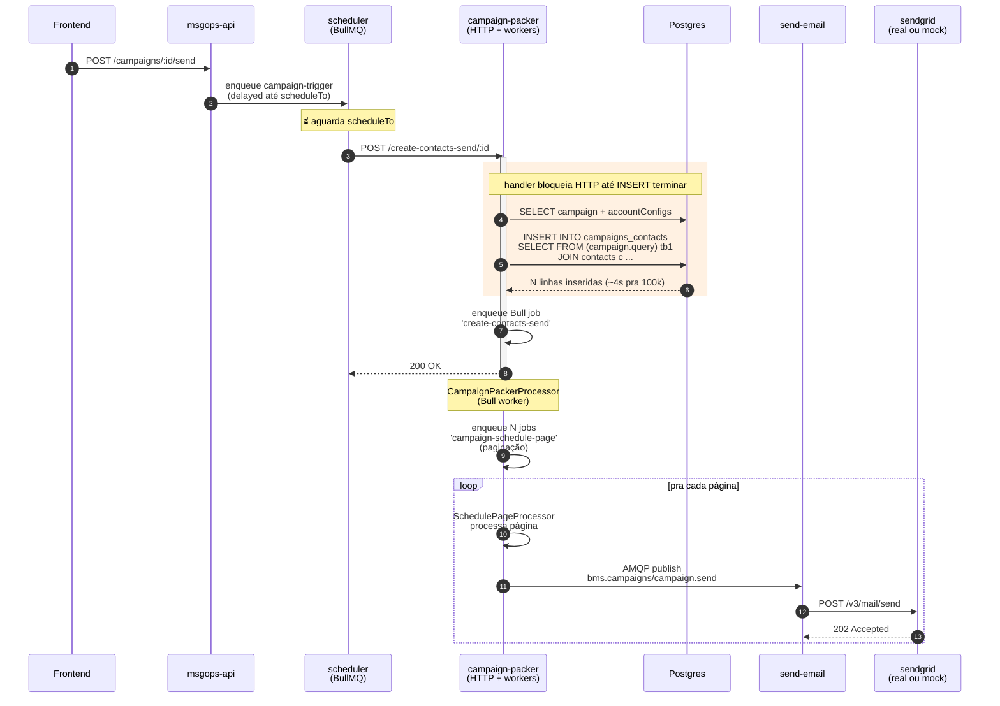
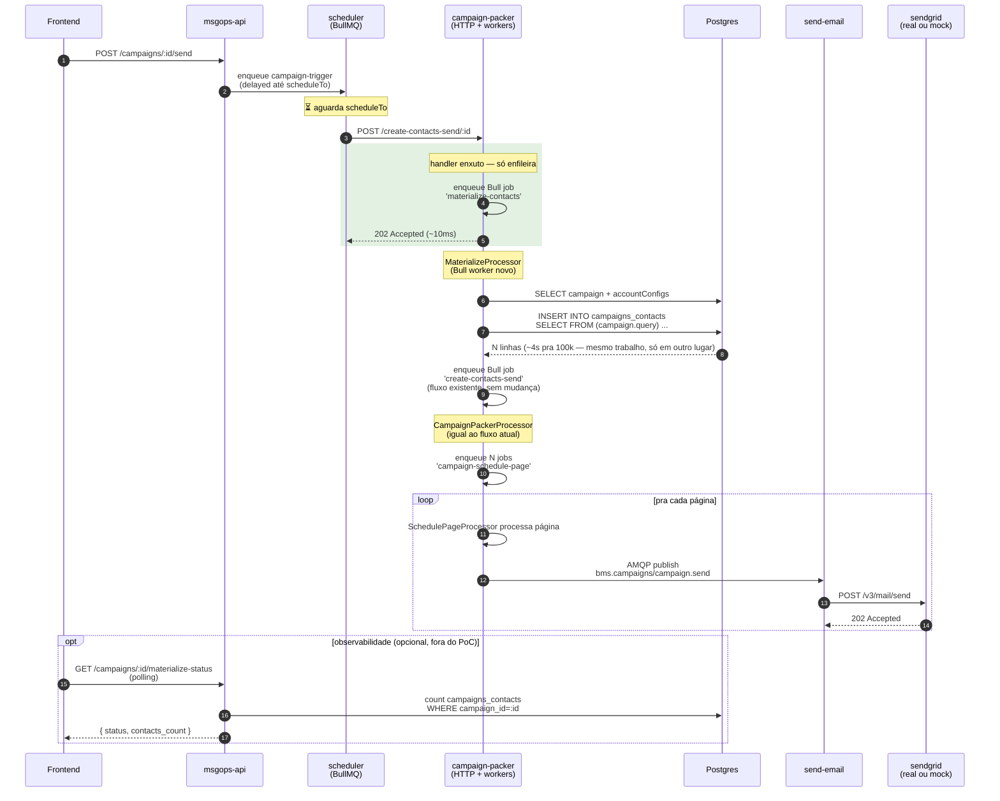

# Materialização assíncrona de `campaigns_contacts` — brainstorm

## O que esta proposta resolve (e o que NÃO resolve)

Motivada pelo EVO-1027 (testes de carga). Os números mostraram que `POST campaign-packer:3000/create-contacts-send/:id` escala quase-quadrático com o volume:

| Volume | p95 (local) | p95 (staging) |
| ------ | ----------- | ------------- |
| 1k     | 0.07 s      | 0.56 s        |
| 10k    | 0.37 s      | 0.71 s        |
| 50k    | 1.63 s      | 1.32 s        |
| 100k   | 4.25 s      | 2.12 s        |

A primeira leitura natural foi "gargalo". **Não é, no sentido de throughput.** O drain total da campanha (~670s pra 10k–100k em ambos os ambientes) é dominado pelo `send-email → sendgrid`, não pelo INSERT. Os 4s do INSERT são ruído num processo de horas. Tornar o endpoint assíncrono **não acelera o envio em si**.

O que ele **realmente resolve** são preocupações operacionais que aparecem em volumes maiores:

1. **Risco de timeout HTTP em 500k+.** Traefik/Nest/scheduler têm timeouts default (60s comum). A 1M contatos o INSERT projeta >30s — perigosamente perto. Async sidestepa.
2. **Semântica honesta do endpoint.** `POST /create-contacts-send` é fire-and-forget conceitualmente — o caller (scheduler) joga fora a resposta. Hoje finge ser síncrono. 202 reflete a realidade.
3. **Scheduler workers livres.** Hoje cada trigger segura conexão HTTP por N segundos. Se 10 campanhas disparam juntas, 10 workers presos. Async libera em ~10ms.
4. **Retry mais sano.** Falha de PG no meio do INSERT hoje vira retry do POST inteiro pelo scheduler. Com Bull job: backoff exponencial, observável, idempotente via `ON CONFLICT DO NOTHING` que já existe.

O que **não** resolve:

- Tempo total da campanha (dominado pelo drain `send-email → sendgrid`)
- Throughput de e-mails/min
- Carga em Postgres (mesma quantidade de I/O)
- Visibilidade pra usuário final (campanha "em processamento" sem contador, a não ser que se adicione endpoint de status)

**Em uma frase:** é uma melhoria de **resiliência operacional pra alta carga**, não de performance percebida pelo usuário. Vale considerar quando produção começar a mandar 500k+ rotineiramente, ou se algum critério de SLI passar a se importar com latência de trigger HTTP.

## Fluxo atual

**Observação chave:** o INSERT (passo 5) acontece **dentro** do handler HTTP. O scheduler (passo 4) fica aguardando o response até o INSERT terminar.

## Fluxo proposto

Mover o INSERT pra um job Bull (`materialize-contacts`) novo, que vira a primeira etapa do pipeline do packer. HTTP retorna 202 imediato.

**Mudança crítica em uma linha:** o `await` da query sai do handler HTTP e entra num worker Bull dedicado. O trabalho é o mesmo. Quem espera muda.

## Trade-offs

| Eixo                             | Hoje                                                      | Proposto                                                                  |
| -------------------------------- | --------------------------------------------------------- | ------------------------------------------------------------------------- |
| Latência HTTP do trigger         | O(N) — 0.07s → projetado >30s no 1M                       | O(1) — ~10ms constante                                                    |
| Tempo total enqueue→último envio | dominado pelo drain (~670s pra 100k)                      | igual — INSERT continua mas drain é o mesmo                               |
| Throughput de e-mail             | inalterado                                                | inalterado                                                                |
| Risco de timeout (Traefik/Nest)  | real em 500k+                                             | inexistente                                                               |
| Contrato API                     | resposta síncrona "campanha materializada com N contatos" | resposta 202 "campanha aceita, materializando"                            |
| Falha do INSERT                  | erro HTTP, scheduler retenta o POST                       | job Bull falha, backoff exponencial, observável                           |
| Frontend                         | contador final imediato no response                       | precisa estado "processando" + (opcional) endpoint de status pra contador |
| Idempotência                     | `ON CONFLICT DO NOTHING` já protege                       | mesmo `ON CONFLICT` + Bull dedup por `jobId=materialize-${campaignId}`    |
| Scheduler workers ocupados       | N segundos por trigger (4s pra 100k, mais pra 1M)         | ~10ms                                                                     |

## Por que esta seria a opção certa (vs alternativas que considerei)

- **Paginar o INSERT dentro do handler síncrono**: divide a transação mas não muda a latência do response. Não ajuda em nenhuma das 4 preocupações operacionais.
- **Reescrever a query como cursor paginado**: ataca de um lado errado — a query em si já não é o gargalo. Postgres faz INSERT-from-SELECT em 100k em 1-2s no NVMe. O ponto sensível é a _espera síncrona_, não a velocidade da query.
- **Background-isolar via job dedicado** (proposta acima): match natural com a arquitetura — campaign-packer **já é uma queue**. Só falta entrar o INSERT no início desse pipeline. Mudança cirúrgica num único service, sem rearquitetura.

## Escopo de PoC (caso seja priorizado)

3 níveis possíveis:

1. **Mínimo**: muda `app.controller.ts` + cria `MaterializeProcessor` + enfileira `create-contacts-send` no fim. Sem mexer no frontend (campanha aparece "processando" sem indicador, usuário vê na próxima refresh). Demonstra `p95 antes vs depois`. **~2h**.
2. **Mínimo + endpoint de status**: igual + `GET /campaigns/:id/materialize-status` retornando `{status, contacts_count}`. Contrato pro frontend consumir existe. **~½ dia**.
3. **Mínimo + frontend integrado**: PR mergeável de verdade. Provavelmente fora de escopo de PoC. **~2-3 dias**.

## Riscos / pontos de atenção

- **`stop_campaign_<id>` check em Redis** hoje fica no início de `createContactsSend` do service. No fluxo novo, migra pro `MaterializeProcessor` (ou pra re-enqueue de `create-contacts-send`).
- **Race entre múltiplos triggers da mesma campanha**: hoje tratada pelo `ON CONFLICT DO NOTHING` no INSERT + Redis dedup em `createBatches`. Manter Bull jobId determinístico (`materialize-${campaignId}`) pra impedir dois MaterializeProcessor concorrentes.
- **"Campanha materializada com N contatos" no response hoje**: vira polling/websocket. Pra PoC nível 1: assumir que produto aceita 202 sem contador.
- **Re-enqueue de `create-contacts-send` no fim do MaterializeProcessor**: precisa preservar todos os args originais (campaignId + qualquer metadata que CampaignPackerProcessor consome). Não pode quebrar contrato com `addCampaignPacker(campaign)` atual.

## Decisão pendente

Não é uma melhoria de performance — é de resiliência operacional. Faz sentido se/quando:

- Produção começar a mandar 500k+ rotineiramente
- Aparecer caso real de timeout HTTP no scheduler ou em algum proxy
- Houver vontade de limpar o contrato do endpoint (semântica honesta)
- Quiser fazer a escada do EVO-1027 ir além de onde o critério p95 5s artificialmente trava

**Sem nenhum desses gatilhos, não vale o esforço hoje.**
